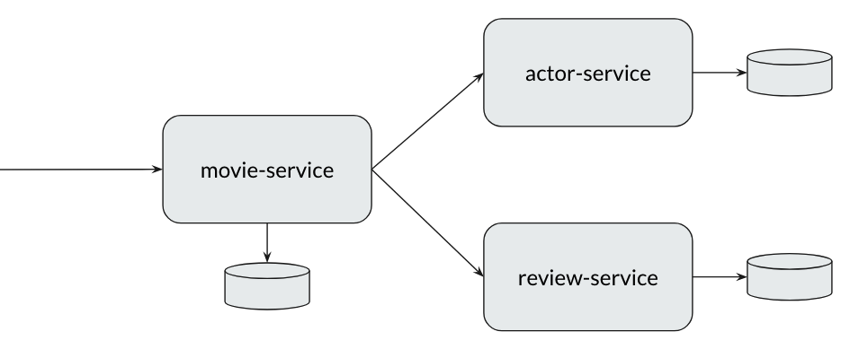

# 🎬 Trace-Flix

**Trace-Flix** is a simple microservices-based application built for this course to **learn and practice observability with OpenTelemetry**.

It consists of **three services**:

* `movie-service`
* `actor-service`
* `review-service`

The goal of this application is to demonstrate how distributed tracing, metrics, and logs can help us debug and understand interactions across services. This app is intentionally designed to be simple, predictable, and observable. Feel free to update this project as you wish!

## Services

| Service            | Description                                                                                           | API Endpoint                         |
| ------------------ | ----------------------------------------------------------------------------------------------------- | ------------------------------------ |
| **actor-service**  | Provides actor details for a given **actor ID**.                                                      | `GET /api/actors/{actorId}`          |
| **review-service** | Provides reviews for a given **movie ID**.                                                            | `GET /api/reviews?movieId={movieId}` |
| **movie-service**  | Maintains movie IDs, basic info, and associated actor IDs. Acts as the main entry point to the system. Acts as the **main entry point** to the system. | `GET /api/movies/{movieId}`          |

## Architecture



The **movie-service** is the central entry point.
For example, when a request is sent for movie ID `2`, it fetches data from both **actor-service** and **review-service** to return complete movie details.

Example response for `GET /api/movies/2`:

```json
{
  "id": 2,
  "title": "The Godfather",
  "releaseYear": 1972,
  "actors": [
    {
      "id": 3,
      "name": "Marlon Brando"
    },
    {
      "id": 4,
      "name": "Al Pacino"
    }
  ],
  "reviews": [
    {
      "id": 3,
      "rating": 5,
      "comment": "A flawless classic. The tension and performances are unmatched.",
      "reviewer": "Sophie"
    },
    {
      "id": 4,
      "rating": 4,
      "comment": "Great film, but a bit long for my taste.",
      "reviewer": "Leo"
    }
  ]
}
```

## Supported Movie IDs

* **1–7** → Normal & fast responses.
* **8, 9** → Simulated slow responses.
* **10** → Always throws an error (to demonstrate failure scenarios).

This behavior is intentional so we can **observe traces, metrics, and logs under different conditions**.

## Building & Running with Docker

The project includes:

* A **Dockerfile** for each individual service.
* A **docker-compose.yaml** file at the project root to orchestrate all services together.

### Steps

From the **project root directory**, run:

```bash
# 1. build application JAR files. Ensure that you have Java 24+ is installed.
mvn clean package

# 2. build docker images and start all services
docker compose up --build
```

This will build the JARs, create Docker images for each service, and bring up the full Trace-Flix application.

## Testing the Services

Once the application is up and running, we can test it using **Postman** or browser/curl.

### Sample Requests

```bash
# normal & fast responses
http://localhost:8080/api/movies/1
http://localhost:8080/api/movies/2

# simulated slow response
http://localhost:8080/api/movies/9

# simulated error
http://localhost:8080/api/movies/10
```
