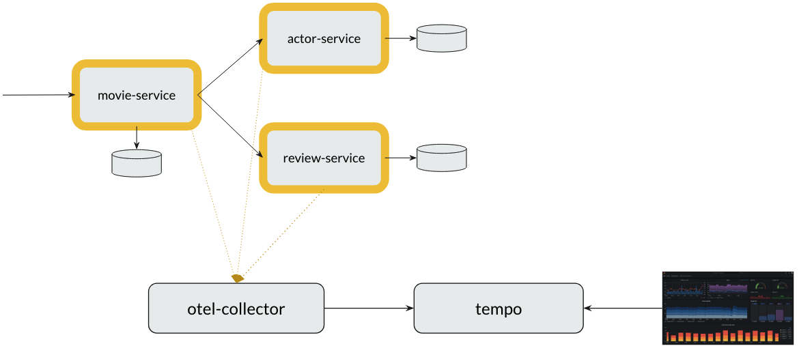

# Distributed Tracing Demo with OpenTelemetry, Tempo & Grafana

This demo shows how **distributed tracing** works in a microservices architecture using **OpenTelemetry**, **Tempo**, and **Grafana**.

## Project Setup



We have 3 microservices:

* **movie-service** → entry point for clients (exposed on port `8080`)
* **actor-service** → returns actor details
* **review-service** → returns movie reviews

Supporting components:

* **otel-collector** → collects telemetry data (traces) from services and exports them
  - Exposes port `4317` (gRPC) and `4318` (HTTP) for services to send telemetry data
  - Forwards traces to Tempo

* **tempo** → backend store for trace data
  - Receives trace data from the collector on ports `4317` (gRPC) or `4318` (HTTP)
  - Exposes port `3200` for Grafana to query traces

* **grafana** → UI to query and visualize traces
  - Exposes port `3000` for the web UI
  - Pre-configured to use Tempo as a data source

> **Note:** This setup is for **learning and demos only**.  
> As Java developers, we are usually **not expected** to set up observability infrastructure in production.  
> In real-world projects, DevOps/SRE teams typically deploy and manage these components (Tempo, Grafana, OpenTelemetry Collector, etc.) using tools like **Helm charts** and Kubernetes.  
> For this course, we use **Docker Compose** to simplify the setup and focus on learning how to instrument and observe applications.


## Prerequisite

- Make sure Docker has sufficient resources allocated.  
  - At least **4 CPUs** and **8 GB RAM** are recommended.
- Ensure that you have built these docker images.
```
vinsguru/movie-service
vinsguru/actor-service
vinsguru/review-service
```
## Demo

- Start everything. Wait for 30 seconds and ensure that all the containers are up and running.

```bash
docker compose up
```

- Access Grafana: [http://localhost:3000](http://localhost:3000)

  * username: `admin`
  * password: `admin`