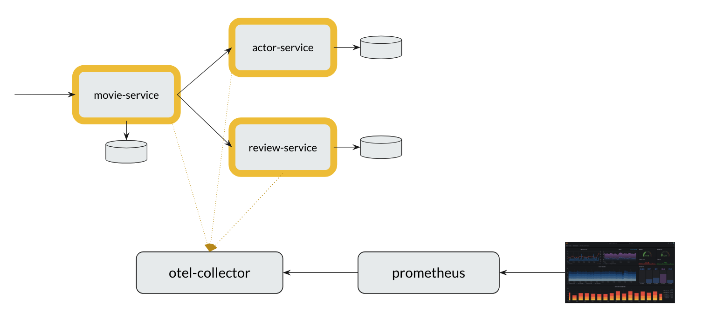
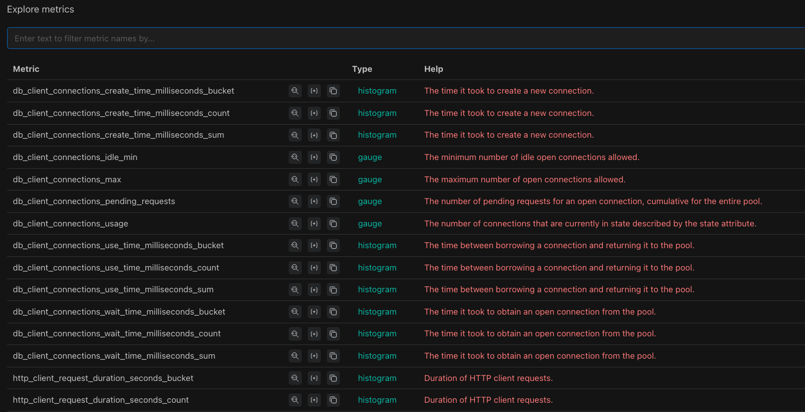
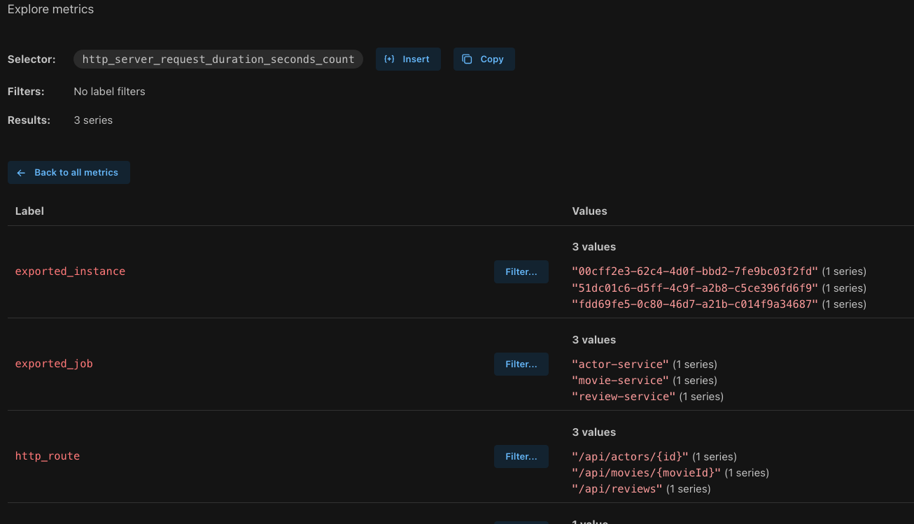

# Metrics Demo with Prometheus

This project brings up our `trace-flix` application, OpenTelemetry Collector, and Prometheus using **Docker Compose**. 



## Step 1: Bring Everything Up

```bash
docker compose up

# wait for all containers to be healthy
docker compose ps -a
```

## Step 2: Open the Prometheus UI

Go to:

* **Targets** → [http://localhost:9090/targets](http://localhost:9090/targets)
* **Config** → [http://localhost:9090/config](http://localhost:9090/config)
* **Query UI** → [http://localhost:9090/query](http://localhost:9090/query)

## Step 3: Send Some Requests

* Send a few **successful requests** to the app.
```bash
curl http://localhost:8080/api/movies/1
curl http://localhost:8080/api/movies/2
curl http://localhost:8080/api/movies/3
```

## Step 4: Explore Metrics

Prometheus automatically collects metrics from the OTel Collector.



Each metric has a **name** and **labels**.



| Metric Name                                | Meaning                                                    |
|--------------------------------------------|------------------------------------------------------------|
| `http_server_request_duration_seconds_count` | Total number of requests observed                          |
| `http_server_request_duration_seconds_sum`   | Total time spent across all observed requests (in seconds) |
| `http_server_request_duration_seconds_bucket`| Histogram buckets used to calculate percentiles (p90, p95, etc.) |

## Step 5: Query Metrics - Table View

Go to the **Table** view of **Query UI** → [http://localhost:9090/query](http://localhost:9090/query)

```promql
http_server_request_duration_seconds_count
```
When we query above measurement, we will see **multiple records** because the data is grouped by:

* `exported_job` (service)
* `http_route` (path)
* `http_response_status_code`
* `http_request_method`

The above query gives only the latest values. In Prometheus, we call this an **instant vector** - a snapshot at the current moment.

To see the scraped values over a time window (instead of just the latest one), we use a range query. We call this **range vector**.

```promql
http_server_request_duration_seconds_count[1m]
```
Now send a few more requests, wait for sometime and refresh.

```bash
curl http://localhost:8080/api/movies/1
curl http://localhost:8080/api/movies/2
curl http://localhost:8080/api/movies/3
```
When we check the table view in Prometheus, we can notice that the counter value has gone up. This confirms that Prometheus has scraped the new metrics and updated the count.

## Step 6: Query Metrics - Graph View

Go to the **Graph** view of **Query UI** → [http://localhost:9090/query](http://localhost:9090/query)

```promql
http_server_request_duration_seconds_count
```

## Step 7: Add Some Errors

Send a **failed request**.

```bash
curl http://localhost:8080/api/movies/10
```

Wait for sometime and re-run the query in the table view:

```bash
http_server_request_duration_seconds_count
```

Now we should see extra records with the `http_response_status_code="500"` label.

## Step 8: Querying Basics
- Check [here](https://prometheus.io/docs/prometheus/latest/querying/basics/) for more details
- To filter only `movie-service` related records.
```bash
http_server_request_duration_seconds_count{exported_job="movie-service"}
```
- `movie-service` and 500 failed errors only
```bash
http_server_request_duration_seconds_count{exported_job="movie-service", http_response_status_code="500"}
```
- OR condition - approach 1 using regex match
```bash
http_server_request_duration_seconds_count{exported_job=~"movie-service|actor-service"}
```
- OR condition - approach 2
```bash
http_server_request_duration_seconds_count{exported_job="movie-service"} or http_server_request_duration_seconds_count{exported_job="actor-service"}
```
- NOT condition
```bash
http_server_request_duration_seconds_count{http_response_status_code!="404"}
```

## Step 9: Aggregations

- Total requests received by `movie-service`

```bash
sum(http_server_request_duration_seconds_count{exported_job="movie-service"})
```

- We also have min, max, avg, count etc
```bash
max(http_server_request_duration_seconds_count)
min(http_server_request_duration_seconds_count)
```  

- Total success requests - grouped by service:

```bash
sum by (exported_job) (
    http_server_request_duration_seconds_count{http_response_status_code="200"}
)
```

- Total Failures (response code is either 4XX or 5XX) - grouped by service:

```bash
sum by (exported_job) (
    http_server_request_duration_seconds_count{http_response_status_code=~"4..|5.."}
)
```

- Sum by http route and response status code
```bash
sum by(http_route, http_response_status_code) (
    http_server_request_duration_seconds_count
)
```

## Step 10: Range Functions

In Prometheus, we rarely look at raw counter values directly.
We are usually more interested in how those values change over time, using functions like `rate()` and `increase()`. If you want to know more about these functions, check [here](https://prometheus.io/docs/prometheus/latest/querying/functions/).

- Note:

```bash
http_server_request_duration_seconds_count[5s]
```

>This query might not return results sometimes - because our scrape interval is 10s. so in the last 5s we might not have any records. Also range queries will usually work only when we have at least 2 scrapes. so it is recommended to use 2X scrape values.

* Requests processed in the last 1 min:

```bash
increase(http_server_request_duration_seconds_count{exported_job="movie-service"}[1m])
```

* Requests processing rate in the last 1 min:

```bash
rate(http_server_request_duration_seconds_count{exported_job="movie-service"}[1m])
```

## Step 11: Response Time Metrics

* Total time spent serving requests:

```bash
http_server_request_duration_seconds_sum
```

### Average response time

- wrong approach
```bash
http_server_request_duration_seconds_sum{exported_job="movie-service"} / http_server_request_duration_seconds_count{exported_job="movie-service"}
```
- correct approach (over 1m window)

```bash
rate(http_server_request_duration_seconds_sum{exported_job="movie-service"}[1m]) / 
rate(http_server_request_duration_seconds_count{exported_job="movie-service"}[1m])
```

### Percentiles

```bash
histogram_quantile(
  0.90, http_server_request_duration_seconds_bucket{exported_job="movie-service", http_response_status_code="200"}
)
```
This gives the **90th percentile latency** which means 90% of requests finished faster than this value.

## Other Metrics
- Memory used
```bash
jvm_memory_used_bytes{exported_job="movie-service"}
```

- Thread count
```bash
jvm_thread_count{exported_job="movie-service"}
```

- DB Connections usage

```bash
db_client_connections_usage{exported_job="movie-service"}
```

## Grafana Demo

- CPU Utilization by `movie-service`
```bash
jvm_cpu_recent_utilization_ratio{exported_job="movie-service"} * 100
```

- Number of requests processed by `movie-service` per min
```bash
increase(
    http_server_request_duration_seconds_count{exported_job="movie-service"}[1m]
)
```

- Number of client requests sent by `movie-service` per min
```bash
sum by(server_address)(
    increase(
        http_client_request_duration_seconds_count[1m]
    )
)
```

## Useful References

* [Prometheus Query Basics](https://prometheus.io/docs/prometheus/latest/querying/basics/)
* [Prometheus Functions](https://prometheus.io/docs/prometheus/latest/querying/functions/)
