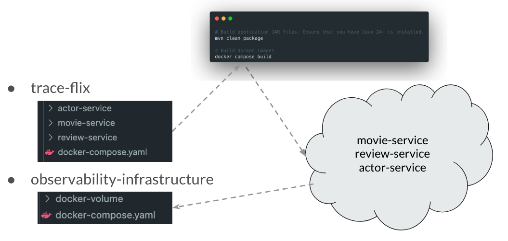

# TraceFlix With OpenTelemetry Spring Boot Starter

## Add Dependency Management

Include the OpenTelemetry dependency management in the main `pom.xml`.

```xml
<dependencyManagement>
    <dependencies>
        <dependency>
            <groupId>io.opentelemetry.instrumentation</groupId>
            <artifactId>opentelemetry-instrumentation-bom</artifactId>
            <version>2.20.1</version>
            <type>pom</type>
            <scope>import</scope>
        </dependency>
    </dependencies>
</dependencyManagement>
```

Add this dependency to all the modules. The following dependency includes logback appender.

```xml
<dependency>
    <groupId>io.opentelemetry.instrumentation</groupId>
    <artifactId>opentelemetry-spring-boot-starter</artifactId>
</dependency>
```

## Build and Run

Run the following commands:

```bash
mvn clean package
docker compose up --build
```

If you run the application at this point it will throw exceptions because it attempts to export spans without observability infrastructure.
We can disable OpenTelemetry during local development.

### Option A: Application Properties

```properties
otel.sdk.disabled=true
```

or

```properties
otel.traces.exporter=none
otel.metrics.exporter=none
otel.logs.exporter=none
```

### Option B: Environment Variables

```bash
OTEL_SDK_DISABLED=true
```

or

```bash
OTEL_TRACES_EXPORTER=none
OTEL_METRICS_EXPORTER=none
OTEL_LOGS_EXPORTER=none
```

## Building Docker Images


Whenever you make code changes, follow these steps

1. Run the following command under the `trace-flix` folder to build new Docker images:

   ```bash
   mvn clean package
   docker compose build
   ```

2. Go to the `observability-infrastructure` folder and start fresh

   ```bash
   docker compose down
   docker compose up
   ```

## Demo 1: Zero Code Instrumentation - Traces, Metrics, and Logs

Send a few requests using Postman.

```
http://localhost:8080/api/movies/1
http://localhost:8080/api/movies/9
http://localhost:8080/api/movies/10
http://localhost:8080/api/movies/11
```

Open Grafana and explore Logs, Traces, and Metrics.

Note: Metrics may not be available for the above requests. This is expected. Remember how functions like `rate` and `increase` behave.

## Demo 2: Fixing Concurrent Requests

```java
.gather(
    Gatherers.mapConcurrent(
        5, 
        Context.current().wrapFunction(this.actorClient::getActor)
    )
)
```

[Rebuild the Docker images](#building-docker-images). Then send requests and check traces.

```
http://localhost:8080/api/movies/1
http://localhost:8080/api/movies/9
http://localhost:8080/api/movies/10
```

## Demo 3: Custom Spans

We can add spans with the `@WithSpan` annotation. Note: It uses `Spring-AOP` under the hood.

```java
@WithSpan("process-payment")
public PaymentResponse processPayment(PaymentRequest request) {
    var span = Span.current();
    ...
    ...
    span.addEvent("Payment failed. retrying...");
    ...
    ...
    span.setAttribute("payment.method", "CREDIT_CARD");
}
```

[Rebuild the Docker images](#building-docker-images). Then send requests and check traces.

```
http://localhost:8080/api/movies/1
http://localhost:8080/api/movies/9
http://localhost:8080/api/movies/10
```

## Demo 4: Custom Metrics

The `opentelemetry-spring-boot-starter` exposes an `OpenTelemetry` bean. From this bean we can create `Meter` and `Tracer`.

Create a metric named `app.movie.view.count` to track movie view counts by `movie.id`.

### Postman Script

Send requests with random movieId.

```javascript
let movieId = Math.floor(Math.random() * 10) + 1;
pm.environment.set("movieId", movieId);
```

### Prometheus Queries

```
app_movie_view_count_total

increase(
    app_movie_view_count_total[1m]
)

sum by(movie_id)(
    increase(
        app_movie_view_count_total[1m]
    )  
)

topk(3, 
    sum by(movie_id)(
        increase(
            app_movie_view_count_total[1m]
        )
    )
)

round(
   topk(3, 
        sum by(movie_id)(
            increase(
                app_movie_view_count_total[1m]
            )
        )
    ) 
)
```

## Customize Auto Configuration

We can customize resource attributes, SdkTracerProvider, SdkMeterProvider, SdkLoggerProvider etc using `AutoConfigurationCustomizerProvider`.